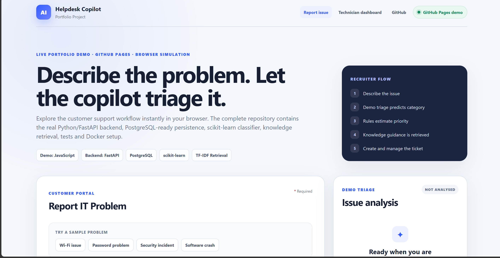
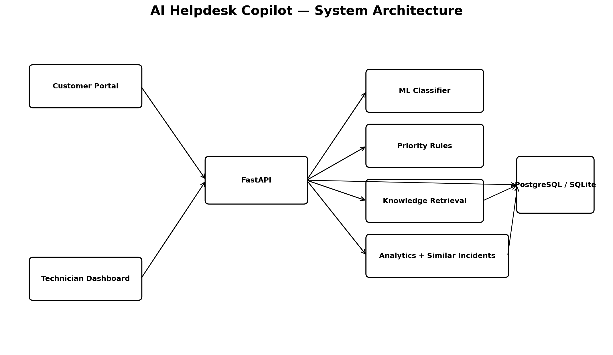

# AI Helpdesk Copilot

[](https://github.com/Billalhossainshishir/ai-helpdesk-copilot/actions/workflows/tests.yml)
[](https://github.com/Billalhossainshishir/ai-helpdesk-copilot/actions/workflows/pages.yml)

An IT support application that helps a customer describe an issue and a technician investigate, prioritise and resolve it. The backend combines ticket management with text classification, transparent priority rules and retrieval of troubleshooting guidance.

## Quick recruiter view

| Explore | Link |
| --- | --- |
| **Live demo** | https://billalhossainshishir.github.io/ai-helpdesk-copilot/ |
| **Reviewer guide** | [docs/REVIEWER_GUIDE.md](docs/REVIEWER_GUIDE.md) |
| **Architecture** | [docs/architecture.md](docs/architecture.md) |
| **Case study** | [docs/case-study.md](docs/case-study.md) |
| **Model evaluation** | [docs/model-evaluation.md](docs/model-evaluation.md) |
| **Database schema** | [docs/database-schema.md](docs/database-schema.md) |


## Project preview



### What to try in 60 seconds

1. Open the **live demo**.
2. Choose a sample issue or type your own.
3. Click **Analyse issue** to see category, priority reasoning and troubleshooting matches.
4. Create a demo ticket.
5. Open **Technician dashboard**.
6. Assign the ticket, add a note and resolve it.
7. Watch the dashboard analytics update.

> **Public-demo honesty:** the GitHub Pages version is an interactive browser simulation designed to open instantly without credentials or backend wake-up time. It does **not** execute FastAPI, PostgreSQL or the trained scikit-learn model. The complete backend, database models, trained classifier, retrieval logic, automated tests and Docker setup are included in this repository and can be run locally.

## Problem and purpose

Many ML portfolio projects stop at a prediction. This project keeps going through the full IT support workflow:

**Describe issue → Analyse issue → ML category prediction → Priority rules → Troubleshooting retrieval → Create ticket → Technician workflow → Resolution → Analytics**

The goal is to demonstrate how machine learning can support a practical service-desk process without hiding business logic behind a black box.

## Architecture



The engineering implementation separates classification, priority rules, retrieval and ticket persistence so each part can be inspected and tested independently.

- **Backend:** Python, FastAPI, SQLAlchemy
- **Database:** PostgreSQL in Docker; SQLite fallback for quick local development
- **Machine learning:** scikit-learn, TF-IDF, Logistic Regression
- **Retrieval:** TF-IDF cosine similarity over the knowledge base and resolved tickets
- **Frontend:** HTML, CSS, JavaScript
- **Charts:** Chart.js
- **Testing:** pytest + FastAPI TestClient
- **Containerisation:** Docker / Docker Compose

See [docs/architecture.md](docs/architecture.md) for the detailed design.

## Live demo

**GitHub Pages:** https://billalhossainshishir.github.io/ai-helpdesk-copilot/

The public recruiter demo uses curated demo logic and browser `localStorage` to simulate the customer and technician workflow.

### Public demo flow

1. Open the customer portal.
2. Choose a sample issue or enter your own.
3. Click **Analyse issue** to see browser-side demo triage, priority reasoning and troubleshooting matches.
4. Create a demo support ticket.
5. Open **Technician dashboard**.
6. Assign the ticket, add notes, change status and resolve it.
7. Watch the dashboard analytics update from browser-stored demo data.

## Portfolio deployment strategy

- **GitHub Pages** provides the fast, zero-login recruiter-facing simulation.
- **The repository** proves the actual engineering implementation.
- **Local/Docker execution** runs the real FastAPI application with SQLAlchemy, PostgreSQL support and the trained scikit-learn model.

This separation is deliberate because GitHub Pages cannot execute Python/FastAPI or host PostgreSQL.

## Features

### Customer portal

- No login required for the portfolio demo
- Four one-click sample issues
- `Analyse issue` before ticket creation
- ML category prediction with confidence
- Explainable Low / Medium / High / Critical priority rules
- Top 3 knowledge-base troubleshooting suggestions with visible retrieval similarity
- Ticket creation with generated helpdesk number
- Requester name and email stored and shown in triage, ticket receipt and technician queue

### Technician dashboard

- KPI cards: open, critical, resolved today, average resolution time, resolution rate
- Category, priority and daily-volume charts
- Search and filters for status, priority and category
- Assignment and status management
- Internal technician notes
- Resolution workflow with `resolved_at`
- Similar resolved incidents using TF-IDF similarity
- Live ticket sync for same-browser submissions plus a polling fallback
- Resettable demo ticket data that never deletes user-submitted tickets
- Backward-compatible handling for legacy demo rows

### API

- `POST /analyse-issue`
- `POST /predict-category`
- `POST /predict-priority`
- `POST /suggest-solution`
- `POST /tickets`
- `GET /tickets`
- `GET /tickets/{id}`
- `PATCH /tickets/{id}`
- `POST /tickets/{id}/notes`
- `GET /tickets/{id}/notes`
- `GET /tickets/{id}/similar`
- `POST /tickets/{id}/resolve`
- `GET /analytics`
- `POST /demo/seed`
- `POST /demo/reset`
- `GET /health`

Interactive OpenAPI documentation is available at `/docs` while the backend is running.

## Run locally without Docker

Python 3.13 matches CI. From the repository root on Windows PowerShell:

```powershell
python -m venv .venv
.\.venv\Scripts\Activate.ps1
python -m pip install --upgrade pip
pip install -r requirements.txt
uvicorn backend.app.main:app --reload
```

Open:

- Customer portal: http://127.0.0.1:8000/
- Technician dashboard: http://127.0.0.1:8000/technician
- API docs: http://127.0.0.1:8000/docs

The default local database is SQLite. The app automatically loads the ML model, seeds 70 troubleshooting articles and adds a small resettable demo ticket set.

## Run with Docker + PostgreSQL

```bash
docker compose up --build
```

Open http://localhost:8000/.

## Train the classifier

```bash
python scripts/train_classifier.py
```

The training file contains **490 synthetic portfolio-safe IT support examples** across:

- Network
- Hardware
- Software
- Account
- Email
- Security
- Other

The evaluation artifacts are written to `models/model_metrics.json` and `models/confusion_matrix.csv`. The synthetic test split is intentionally easy and balanced; its score demonstrates that the code path is working, **not** real-world production accuracy.

## Run tests

```bash
pytest -q
```

Current suite: **25 automated tests** covering ticket CRUD, auto-triage, classifier output, priority rules, knowledge retrieval, notes, similar incidents, analytics and both frontend pages.

GitHub Actions runs the test suite on pushes and pull requests.

## Dashboard reliability notes

- Demo tickets are identified by `DEMO-*` ticket numbers.
- Existing older demo rows using legacy addresses are repaired automatically on startup.
- New user tickets use `HD-*` numbers and are never removed by **Reset demo data**.
- The technician page refreshes automatically every 5 seconds and also receives same-browser ticket-created notifications.
- Ticket list and analytics load independently so a problem in one panel does not blank the whole dashboard.

## Repository structure

```text
ai-helpdesk-copilot/
├── index.html                    # GitHub Pages customer demo
├── technician.html               # GitHub Pages technician demo
├── assets/                       # Browser-demo CSS and JavaScript
├── backend/                      # FastAPI application
├── data/                         # Synthetic training data and knowledge base
├── docs/
│   ├── architecture.png
│   ├── architecture.md
│   ├── case-study.md
│   ├── database-schema.md
│   ├── model-evaluation.md
│   ├── REVIEWER_GUIDE.md
│   └── internal/                 # Development notes and portfolio-copy drafts
├── frontend/                     # Backend-connected pages
├── models/                       # Trained model and evaluation artifacts
├── screenshots/                  # Real screenshot capture checklist / future captures
├── scripts/
├── tests/
├── docker-compose.yml
├── requirements.txt
└── README.md
```

## GitHub Pages demo vs full backend

### GitHub Pages demo

The root `index.html`, `technician.html` and `assets/` files are an interactive browser simulation. Demo tickets are stored locally in the visitor's browser and are safe to reset.

### Full engineering implementation

The `backend/`, `frontend/`, `data/`, `models/`, `tests/`, Docker files and documentation contain the real project implementation. The backend performs ticket persistence, model serving, priority rules, knowledge retrieval, technician operations, similar-incident search and analytics through FastAPI.

## Design decisions

1. **CRUD before AI:** the ticket workflow remains useful even if the model is unavailable.
2. **Classical ML rather than a fake chatbot:** TF-IDF + Logistic Regression gives a reproducible, explainable baseline.
3. **Transparent priority rules:** priority is a business rule, not a black-box probability.
4. **Visible retrieval evidence:** troubleshooting suggestions show which knowledge entries were matched.
5. **Privacy-safe demo:** synthetic ticket data and support articles only.
6. **No recruiter login:** the primary interaction is obvious within seconds.

## Limitations and scope

- This is a **portfolio prototype**, not a production service desk.
- The public GitHub Pages demo is a browser simulation and does not call the Python backend.
- Training tickets and knowledge-base content are synthetic portfolio-safe data.
- Model results on the synthetic evaluation set should not be interpreted as real-world service-desk performance.
- Authentication, authorisation, secrets management, rate limiting, monitoring and production deployment hardening would be required before handling real support data.
- Automated tests cover the API and frontend file expectations; they are not a full browser end-to-end test suite.
- Static UI screenshots are intentionally not used as proof of backend execution; use the live demo for the UI and the reviewer guide/local setup for engineering verification.

## Reviewer documentation

For a reproducible evaluation path, execution modes, troubleshooting and known limitations, read [docs/REVIEWER_GUIDE.md](docs/REVIEWER_GUIDE.md).

## Portfolio summary

Built an AI-assisted IT helpdesk using Python, FastAPI, PostgreSQL and scikit-learn that classifies support tickets, applies transparent priority rules, retrieves troubleshooting guidance, manages technician workflows, searches similar past incidents and provides operational analytics through a live web dashboard.