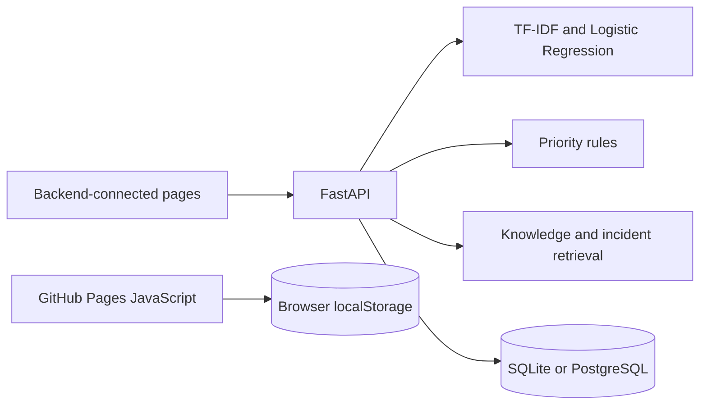

# Reviewing and running AI Helpdesk Copilot

## Choose an execution mode

| Mode | What runs | Where records live |
| --- | --- | --- |
| GitHub Pages | JavaScript triage and a simulated customer/technician workflow | Browser localStorage |
| Local Python | FastAPI, the trained scikit-learn classifier, retrieval and backend-connected pages | SQLite by default |
| Docker Compose | The same Python application with PostgreSQL | Compose database volume |

The public demo does not execute the Python model. Its predicted category and confidence should not be used as evidence of the trained model's behaviour. Use the local API for that comparison. Browser records are not shared between devices or with the backend database.

## Local setup

Clone the repository and run from its root. Python 3.13 matches the checked-in CI workflow; Docker Compose is an alternative to installing Python dependencies locally.

```powershell
git clone https://github.com/Billalhossainshishir/ai-helpdesk-copilot.git
cd ai-helpdesk-copilot
py -3.13 -m venv .venv
.\.venv\Scripts\python.exe -m pip install -r requirements.txt
.\.venv\Scripts\python.exe -m uvicorn backend.app.main:app --reload
```

Using the environment's Python directly avoids a PowerShell activation-policy dependency. On macOS/Linux, create the environment with `python3.13 -m venv .venv` and use `.venv/bin/python` for the same commands.

Open `http://127.0.0.1:8000/`, `/technician` and `/docs`. Do not serve `frontend/` independently for this mode: its relative API requests expect the FastAPI origin.

Settings load from environment variables or a root `.env` file. The defaults use SQLite and seed demo tickets. Read `.env.example` before changing `DATABASE_URL`, `CORS_ORIGINS` or `AUTO_SEED_DEMO`. Keep demonstration data separate from real support information.

## Demonstrate the backend

1. Open `/docs` and call `GET /health`; expect `status: ok`.
2. Use the customer page to analyse a sample issue and create a ticket with a valid sample email such as `reviewer@example.com`.
3. Find that ticket in `/technician`, add a note and resolve it.
4. Check `/tickets` and `/analytics` in Swagger to confirm that the backend stored the change. The browser demo's localStorage is a different data store.

```powershell
.\.venv\Scripts\python.exe -m pytest -q
.\.venv\Scripts\python.exe scripts/train_classifier.py
```

The first command runs the tests. The second retrains the model and rewrites the model/evaluation artifacts; it is optional for the normal startup path. The checked-in suite contains 25 test functions, including API assertions and frontend file-content assertions. Those frontend assertions are not an automated browser interaction test.

## Architecture and decisions



Ticket classification and retrieval solve different problems: the classifier selects a category; cosine similarity retrieves candidate guidance. Priority is calculated separately from explicit rules. The model is evaluated on synthetic examples, so a high score does not establish performance on real service-desk tickets.

## Limits and troubleshooting

- A model-loading error should be investigated against the pinned scikit-learn version and the checked-in model; retraining is an explicit repair option, not something to hide from the reviewer.
- A blank backend page can be checked against `/health`, `/docs` and the browser network panel. Serve the application from the repository root using the command above.
- The system is a portfolio prototype. Authentication, authorisation and deployment hardening are required before handling real tickets.
- The `screenshots/` directory currently contains capture instructions rather than application screenshots. Add real captures of the analysis result and resolved-ticket workflow when available.


## Recorded verification evidence

At documentation review, the existing [GitHub Actions test run](https://github.com/Billalhossainshishir/ai-helpdesk-copilot/actions/runs/35169480816) reported `success` for `ac1cfe9fd9b69458da99538af1669a22484359c0`. This records an existing CI result; the documentation review did not install dependencies or rerun the application locally. Commands above were checked against source files and configuration. A successful CI run does not establish production readiness or validate untested UI integrations.
