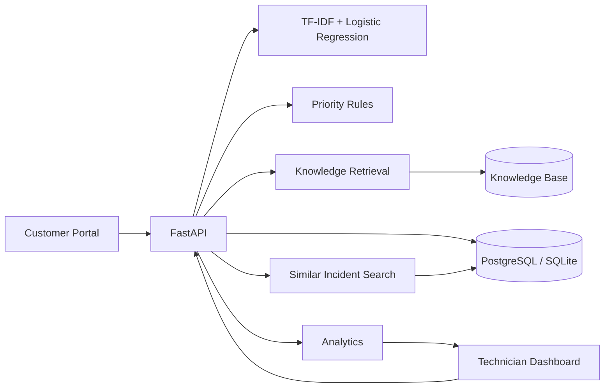

# Architecture

The application uses deterministic business rules for priority and classical ML for category classification. Knowledge and past-incident retrieval use TF-IDF cosine similarity so the evidence can be surfaced directly in the UI.

## Current execution boundary

The diagram above describes the local backend, not GitHub Pages. The public demo uses JavaScript triage and browser localStorage, with no Python-model execution. See [execution modes and verification](REVIEWER_GUIDE.md).
